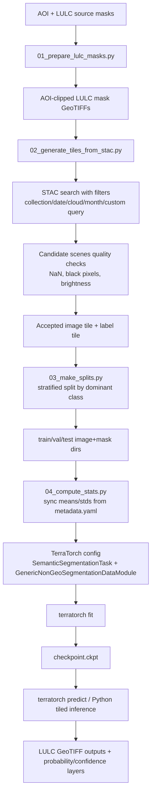

# Source -> Target Pipeline

## Key Design Decisions

1. Keep STAC sampling logic explicit and configurable in `source_to_target.yaml`.
2. Move training/inference orchestration into TerraTorch YAMLs to reduce custom-code drift.
3. Keep normalization aligned with CLAY metadata by syncing means/stds from `metadata.yaml`.
4. Use tiled inference with overlap/blending by default to reduce patch seams.
